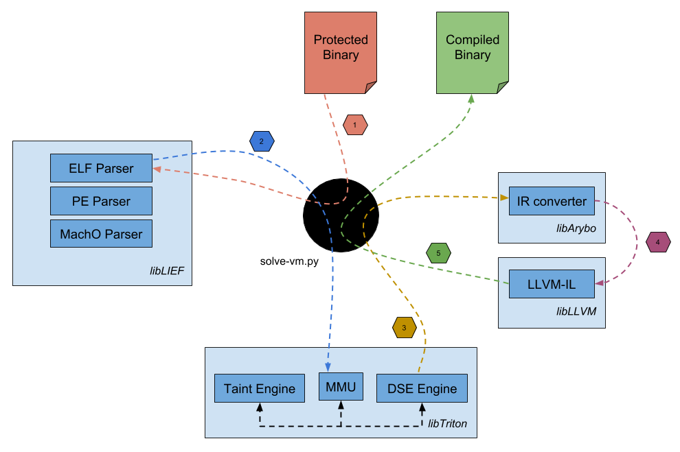
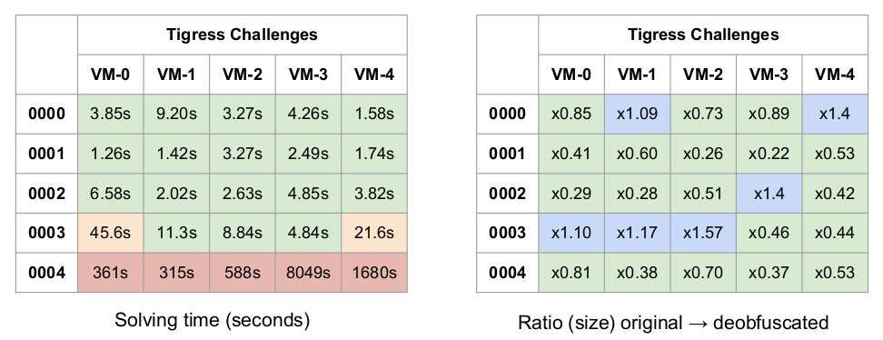
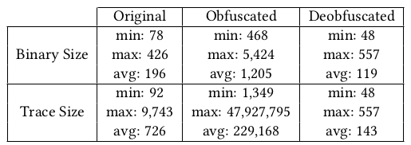

# Tigress Protections

> [Tigress](http://tigress.cs.arizona.edu/) is a diversifying virtualizer/obfuscator for the C language that supports many novel defenses against both static and dynamic reverse engineering and de-virtualization attacks.
> In particular, Tigress protects against static de-virtualization by generating virtual instruction sets of arbitrary complexity and diversity, by producing interpreters with multiple types of instruction dispatch, and by inserting code for anti alias analysis. Tigress protects against dynamic de-virtualization by merging the real code with bogus functions, by inserting implicit flow, and by creating slowly-executing reenetrant interpreters. Tigress implements its own version of code packing through the use of runtime code generation. Finally, Tigress' dynamic transformation provides a generalized form of continous runtime code modification.

# Tigress Challenge

Tigress team has provided some [challenges](http://tigress.cs.arizona.edu/challenges.html#current) where we can find different kind of protections

* **VM-0**: One level of virtualization, random dispatch.
* **VM-1**: One level of virtualization, superoperators, split instruction handlers.
* **VM-2**: One level of virtualization, bogus functions, implicit flow.
* **VM-3**: One level of virtualization, instruction handlers obfuscated with arithmetic encoding, virtualized function is split and the split parts merged.
* **VM-4**: Two levels of virtualization, implicit flow.
* **VM-5**: One level of virtualization, one level of jitting, implicit flow.
* **VM-6**: Two levels of jitting, implicit flow.

# Challenge Format

All challenges take as input a number and return a hash. Example:

<pre>
$ ./obfuscated_binaries/tigress-2-challenge-2 1234
202180712448

$ ./obfuscated_binaries/tigress-2-challenge-2 823748
50564355584

$ ./obfuscated_binaries/tigress-2-challenge-2 2834723
50714072576
</pre>

The hash computation function is obfuscated. Types of possible attacks:

* In a source recovery attack the task is to identify the algorithm that computes SECRET.
* In a data recovery attack the task is to extract a specific run-time or compile-time data item.
* In a metadata recovery attack the task is to identify the sequence of transformations that resulted in SECRET, along with arguments to those transformations, such as the dispatch method used in a virtualization.
* In a location attack the task is to identify the code bytes of the program that comprise the obfuscated SECRET function.

# Automatic deobfuscation

Our goals were to:

* Symbolically extract the hash algorithm
* Simplify these symbolic expressions
* Provide a new simplified version of the binary

And all of this with only one generic script :). To do so, we made in the following order:

* Parse protected binaries with [LIEF](https://github.com/lief-project/LIEF/)
* Symbolically emulate the obfuscated binary with [Triton](https://github.com/JonathanSalwan/Triton)
* Concretize everything which are not related to the user input.
* Convert Triton's expressions to the [Arybo's](https://github.com/quarkslab/arybo) expressions
* Convert Arybo's expressions to the LLVM-IR representation
* Apply LLVM optimizations (O2)
* Rebuild a simplified binary version

If you want more information, you can checkout our [solve-vm.py](solve-vm.py) script.

# solve-vm.py

However, we already pushed all of our results in this repository but if you want to reproduce by yourself this
analysis, you only have to do execute `solve-vm.py` like this:

<pre>
$ ./solve-vm.py ./obfuscated_binaries/_binary_
</pre>

Example:

<pre>
$ ./solve-vm.py ./tigress-challenges/tigress-0-challenge-0
[+] Loading 0x400040 - 0x400238
[+] Loading 0x400238 - 0x400254
[+] Loading 0x400000 - 0x400f14
[+] Loading 0x601e28 - 0x602550
[+] Loading 0x601e50 - 0x601fe0
[+] Loading 0x400254 - 0x400298
[+] Loading 0x400dc4 - 0x400e08
[+] Loading 0x000000 - 0x000000
[+] Loading 0x601e28 - 0x602000
[+] Hooking printf
[+] Hooking __libc_start_main
[+] Hooking strtoul
[+] Starting emulation.
[+] __libc_start_main hooked
[+] argv[0] = ./tigress-challenges/tigress-0-challenge-0
[+] argv[1] = 1234
[+] strtoul hooked
[+] Symbolizing the strtoul return
[+] printf hooked
3035321144166078008
[+] Slicing end-point user expression
[-] Instruction not supported: 0x400539: hlt
[+] Instruction executed: 39816
[+] Unique instruction executed: 458
[+] PC len: 0
[+] Emulation done.
[+] Generating symbolic_expressions/tigress-0-challenge-0.py
[+] Converting symbolic expressions to an LLVM module...
[+] LLVM module wrote in llvm_expressions/tigress-0-challenge-0.ll
[+] Recompiling deobfuscated binary...
[+] Deobfuscated binary recompiled: deobfuscated_binaries/tigress-0-challenge-0.deobfuscated
</pre>

Then, symbolic expressions can be found [here](symbolic_expressions), LLVM representations can be found [here](llvm_expressions)
and recompiled binaries can be found [here](deobfuscated_binaries).

# Testing our simplified binaries

As we simplified and recompiled new binaries, we must provide the same behavior of the original binaries. So, to test our binary versions we use this [script](scripts/testing_equality.py).

<pre>
$ ./scripts/testing_equality.py ./tigress-challenges/tigress-0-challenge-0 ./deobfuscated_binaries/tigress-0-challenge-0.deobfuscated
[...]
[+] Success with 272966812638982633
[+] Success with 2304147855662358786
[+] Success with 15697842028176298504
[+] Success with 15273138908025273913
[+] Success with 17329851347176088980
[+] Success with 12160831137213706322
[+] Success with 3489058267725840982
[+] Success with 6474275930952607745
[+] Success with 7363567981237584398
[+] Success with 3685039181436704621
[+] Success: 100.00
</pre>

Basically, this script runs the obfuscated and the deobfuscated binaries with random inputs and checks if they have the same output results.

# Regarding the Tigress challenge, what are results?

# Testing our approach on others binaries

We also pick up 20 hash algorithms (10 well-known, 10 from the Tigress challenge) and we protected each one of these algorithms
using 46 different Tigress protections (see next section). At the end, we have a test bench of 920 protected binaries. Each one of these protected
binaries has been successfully devirtualized using the `solve-vm.py` script. These hash algorithms can be found in the [samples](samples)
directory and their devirtualized versions into the [deobfuscated_binaries](deobfuscated_binaries) directory. The following table is a summary of
our results regarding our 920 samples.

# Regarding Tigress protections, what did we break?

* Anti Branch Analysis (options: goto2push, goto2call, branchFuns)
* Max Merge Length (options: 0, 10, 20, 30)
* Bogus Function (options: 0, 1, 2, 3)
* Kind of Operands (options: stack, registers)
* Opaque to VPC (options: true, false)
* Bogus Loop Iterations (options: 0, 1, 2, 3)
* Super Operator Ratio (options: 0, 0.2, 0.4, 0.6, 0.8, 1.0)
* Random Opcodes (options: true, false)
* Duplicate Opcodes (options: 0, 1, 2, 3)
* Dispatcher (options: binary, direct, call, interpolation, indirect, switch, ifnest, linear)
* Encode Byte Array (options: true, false)
* Obfuscate Decoder (options: true, false)
* Nested VMs (options: 1, 2, 3)

For more information about these options see pages [1](http://tigress.cs.arizona.edu/options.html) and [2](http://tigress.cs.arizona.edu/transformPage/docs/virtualize/index.html).

# Publication

* [SSTIC - french paper](http://shell-storm.org/talks/SSTIC2017-Article-desobfuscation_binaire_reconstruction_de_fonctions_virtualisees-salwan_potet_bardin.pdf)
* [SSTIC - english slide](http://shell-storm.org/talks/SSTIC2017_Deobfuscation_of_VM_based_software_protection.pdf)
* [SSTIC - french video](https://static.sstic.org/videos2017/SSTIC_2017-06-07_P08.mp4)

# Authors

* [Sébastien Bardin](http://sebastien.bardin.free.fr/) (CEA-LIST)
* [Marie-Laure Potet](https://www-verimag.imag.fr/~potet/) (VERIMAG)
* [Jonathan Salwan](https://twitter.com/JonathanSalwan) (Quarkslab)

# Thanks to

* [Adrien Guinet](https://twitter.com/adriengnt) for the Arybo and LLVM parts (Quarkslab)
* [Romain Thomas](https://twitter.com/rh0main) for some Triton parts (Quarkslab)
